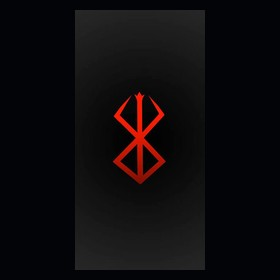

<picture>
  <source media="(prefers-color-scheme: dark)" srcset="./dark.svg">
  <source media="(prefers-color-scheme: light)" srcset="./light.svg">
  
</picture>

 

  

  
  

 

<picture>
  <source media="(prefers-color-scheme: dark)" srcset="https://raw.githubusercontent.com/theblackswordsman1905/theblackswordsman1905/output/github-contribution-grid-snake.svg">
  
</picture>

  

## Projects

| Project | Description | Stack |
|---|---|---|
| **Smart IoT Waste Management** | Smart-bin monitoring with fill sensing, GPS and cloud connectivity | ESP32 • Arduino • IoT |
| **Hand Gesture Control** | Computer-vision gesture interaction | Python • OpenCV |
| **VibeCheck** | Podcast analytics and visualization dashboard | Flask • Python • Pandas |
| **Virtual Library** | Searchable digital library interface | HTML • CSS • JavaScript |

 

  

